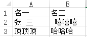
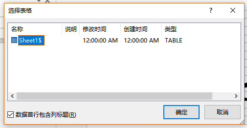
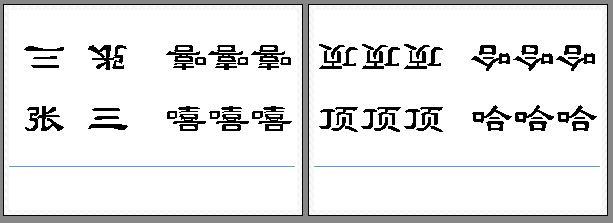

PrintLabel 桌签打印程序使用说明
----
# 1.动机 #
实验室项目结题，各种会比肩接踵。打印桌签、布置会场等这种纯体力活就顺理成章的落在了我们这帮快毕业的学生身上。今天正在打印桌签的时候，忽然凯凯问道，“你为啥不写一个脚本或者批处理程序，一次性打完呢？这样打一张改一张多麻烦。”我说，“这些会开完了就没了，至于还要自己写个脚本吗？这不是闲着蛋疼吗？”，结果凯凯的一句话一语惊醒梦中人，“小伙，too young too simple,还会有很多会在你毕业之前等着你呢。”  

是呀，还是老司机眼光高远。长痛不如短痛，就蛋疼一次吧。

# 2.使用方法 #
目录下有个names.xlsx文件，打开这个excel表格，会发现里面有2列，列标为“名一”和“名二”。如下图所示。先说说为什么会有2列。抱着低碳环保的理念，要最大限度的节约纸张。桌签壳一面的大小是15x8.5cm，一般是两面一起打，所以需要纸张的大小为15x17cm，一张A4纸的大小是21*29.7cm，所以一张A4纸可以勉强打2张桌签。所以名一、名二的一项会打到同一张纸上。  

把要打印的人名均分成两列，写到“名一”“名二”中，写好后保存。一点技巧，当人名是两个字时，中间最好空一格，这样打印出来比较美观。  
然后，点击PrintLabel.exe。先会出现控制台窗口，然后word被打开，接着弹出一个对话框，如下图所示：  
   
点击确定就可以了。然后就会只用默认打印机直接打印。我这默认打印机是pdffactory。如下图所示：  
  
注意图中蓝线，为裁减线。打完后把裁减线以下的空白部分剪掉就可以了。  
如果程序没有走完以上流程，请重新点击程序，多试几次，有点bug。若一直不行，请邮件联系我。  

# 3.修改模版 #
如果你的桌签壳不是15x8.5cm的，可以打开目录下的labels.docx文件。这个是打印的模版文件，你只要把它改成你需要的样子就可以了。这是个体力活。

# 4.原理 #
说白了，很简单，就是使用的word的“邮件合并”功能，具体的用法自行百度之。然后使用python写了一个脚本来模拟这个动作。

# 5.版权申明 #
装x一下，要用随便拿去用，但愿你不会去干打印桌签这种体力活，如果你真干上了，希望这个脚本可以帮你节约时间。  

有任何问题，欢迎发邮件给我，一起交流。E-mail:shawpan@yeah.net
